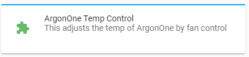
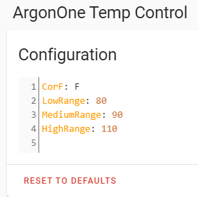
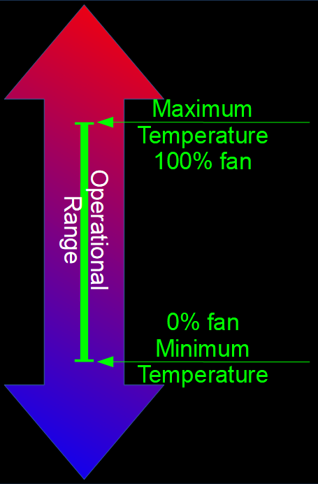

This Addon enables and activates automated active cooling.

# Installation

Within HA

1. Click Supervisor.
1. Click Add-on Store.
1. Click the … button (in top left).
1. Add this Repository URL.

Click ArgonOne Temp Control and install.

# Configuration

## Celsius or Fahrenheit

Choose Celsius or Fahrenheit.

- **Celsius or Fahrenheit** - Configures Celsius or Fahrenheit.

## Temperature Ranges

Set your fan ranges appropriately.

- **Minimum Temperature** Lower temperatures will turn the fan off.
- **Maximum Temperature** The temperature at which the fan operates at 100%.

# Enable I2C

In order to enable i2C, you must follow one of the methods below.

## The easy way

[Use the addon](https://community.home-assistant.io/t/add-on-hassos-i2c-configurator/264167)

## The official way

[Use the guide](https://www.home-assistant.io/hassio/enable_i2c/)
