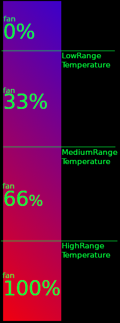

This Addon enables and activates automated active cooling.

# Installation

Within HA
1. Click Supervisor.
2. Click Add-on Store.
3. Click the … button (in top left).
4. Add this Repository URL.

Click ArgonOne Temp Control and install.

# Configuration

## Celcius or Farenheit

Choose Celcius or Farenheit.

- **CorF** - Configures Celcius or Fahrenheit.

## Temperature Ranges

Set your fan ranges appropriately.

- **LowRange** Minimum Temperature to turn oon 33%. Lower will turn the fan off.
- **MediumRange** to be the temperature divider between 33 and 66%.
- **HighRange** to be the maximum temperature before 100% fan.

# Enable I2C

In order to enable i2C, you must follow one of the methods below.

## The easy way

[Use the addon](https://community.home-assistant.io/t/add-on-hassos-i2c-configurator/264167)

## The official way

[Use the guide](https://www.home-assistant.io/hassio/enable_i2c/)
